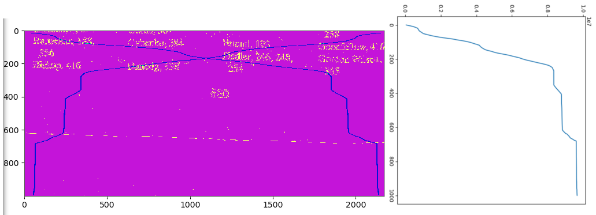

# Processing index page images for Strang (2019) Linear Algebra and Learning from Data

- [x] Image files were taken on my phone camera, stored in `img/`
- [x] Bash script renamed them to their page numbers (see `src/rename_images.sh`)
  - Index of authors: `420.jpg` - `422.jpg`
  - Index of topics:  `423.jpg` - `431.jpg`
  - Index of symbols: `432.jpg`
- [ ] Python script `src/process_scans.py` crops, sharpens, and increases
  the contrast of the 'scan' images, then assembles them into a single PDF
  (see `doc/index_auth.pdf`, `doc/index_topics.pdf`, `doc/index_symbols.pdf`)
- [ ] Tesseract was run on the [author and topic] index PDFs to add an OCR annotation
  text layer

## Notes on `process_scans.py`

An example to give an idea of how the windowing function works:

```python
from image_funcs import scale_img, boost_contrast, brighten, show_img, grade
from process_scans import img_dir, images
from imageio import imread
import numpy as np
import matplotlib.pyplot as plt

test_img = imread(img_dir / images[0])
boosted = boost_contrast(scale_img(test_img))
bg = grade(brighten(boosted))
bg_sample = bg[3540:3655, 0:120]
# Display the edge image (from Canny), note how a page edge is thin but not flat
show_img(bg_sample)
```

Next display a cumulative sum of the sum of scanlines (i.e. image rows)
to see how there is a 'plateau' corresponding to 'empty' scanlines

```python
plt.plot(np.cumsum(np.sum(bg[3000:4000,:], axis=(1))))
plt.show()
```



The idea is that the regions where it rises can be 'windowed', i.e. take
the length of this 'rise' (the number of scanlines which enclose the region
in which the count of edges is increasing) as the size of a 'window'. Take
the maximum value over the width of this region of scanlines and if there is
a single connected line this 'window function' will be non-zero for the whole
width of the scanline window. If the region corresponds to columnar text, then
there will be gaps in the window. If the region corresponds to a page number,
the 'window function' will mostly return zero along the width of the image.
