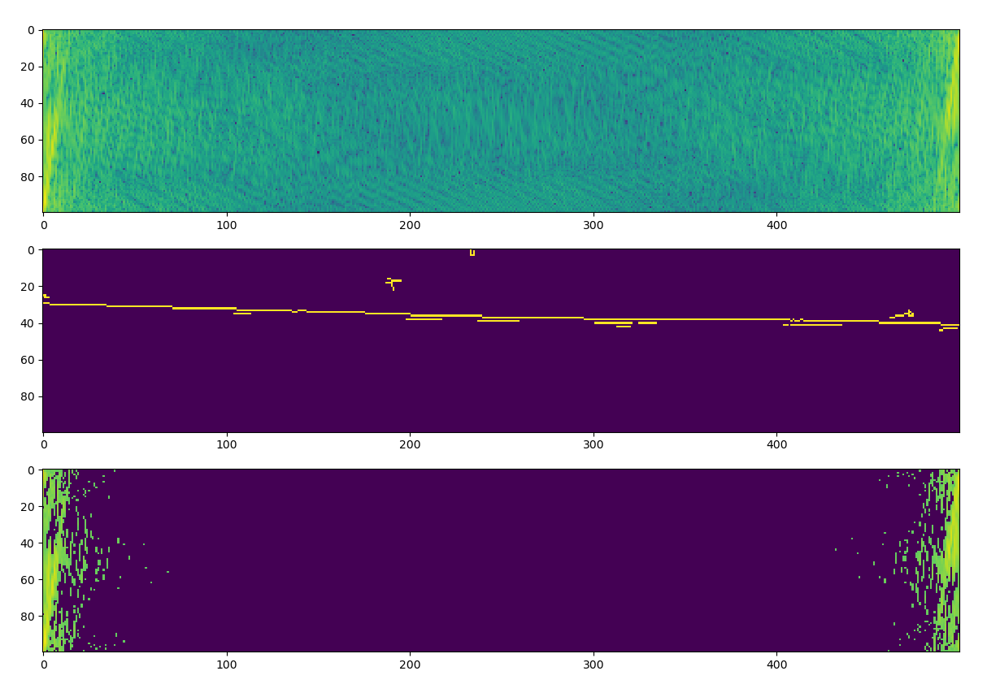

# Processing index page images for Strang (2019) Linear Algebra and Learning from Data

- [x] Image files were taken on my phone camera, stored in `img/`
- [x] Bash script renamed them to their page numbers (see `src/rename_images.sh`)
  - Index of authors: `420.jpg` - `422.jpg`
  - Index of topics:  `423.jpg` - `431.jpg`
  - Index of symbols: `432.jpg`
- [ ] Python script `src/process_scans.py` crops, sharpens, and increases
  the contrast of the 'scan' images, then assembles them into a single PDF
  (see `doc/index_auth.pdf`, `doc/index_topics.pdf`, `doc/index_symbols.pdf`)
  - [x] Identify page boundary for cropping images if shown (using FFT of Canny edge map)
  - [x] Produce explicit contours for this boundary, assuming that the marching squares
        algorithm will be able to determine the single best choice for this, while
        reducing wasted computation by only looking for contours within the area
        identified by FFT signal processing). From the candidates obtained, the widest
        that span the region in question are taken, with some requirements:
    - The 1 or 2 contours must span the entirety of the region (adjustable by changing
      the parameter `c_len` in the function `estimate_contour_sparsity`\* and modifying
      the control logic to `scan_sparsity` which is currently
      programmed to reject [`scan_sparsity` will print "rejected (too sparse: {sparsity})"
      if `v_verbose` is switched on by setting the `verbosity` parameter to 2, which is
      in turn passed through parameters of `calculate_sparsity`\**]
      - \* [which in practice turned out to be of little use in distinguishing candidate
        contour FFT spectra]
      - \** For an example of the usage of `calculate_sparsity` see `example_scan_fft` in
        `src/process_scans.py`.
    - The region can be spanned by two (note that the join and merge algorithms are
      actually written to handle junctions [i.e. gaps] in more than 2 contour paths,
      i.e. it would be trivial to extend this if max. 2 turns out to be insufficient)
  - [ ] Fan left and right from 'seed' x region of 300-800 (default), assuming it will be
        in bottom 20% of the image (may need to adjust using `crop_from_top` parameter)
  - [ ] Sharpen, increase contrast, adjust colour balance of photos to enhance OCR
  - [ ] Assemble images into single PDF
- [ ] Tesseract was run on the [author and topic] index PDFs to add an OCR annotation
  text layer

## Notes on `process_scans.py`

An example to give an idea of how the windowing function works:

```python
from image_funcs import scale_img, boost_contrast, brighten, show_img, grade
from process_scans import img_dir, images
from imageio import imread
import numpy as np
import matplotlib.pyplot as plt

test_img = imread(img_dir / images[0])
boosted = boost_contrast(scale_img(test_img))
bg = grade(brighten(boosted))
bg_sample = bg[3540:3655, 0:120]
# Display the edge image (from Canny), note how a page edge is thin but not flat
show_img(bg_sample)
```

As a one-line function to display from the list of images:

```python
def pic_n(n):
  show_img(grade(brighten(boost_contrast(scale_img(imread(img_dir / images[n])[3000:,:]))))
```

Next display a cumulative sum of the sum of scanlines (i.e. image rows)
to see how there is a 'plateau' corresponding to 'empty' scanlines

```python
plt.plot(np.cumsum(np.sum(bg[3000:4000,:], axis=(1))))
plt.show()
```


The idea is that the regions where it rises can be 'windowed', i.e. take
the length of this 'rise' (the number of scanlines which enclose the region
in which the count of edges is increasing) as the size of a 'window'. Take
the maximum value over the width of this region of scanlines and if there is
a single connected line this 'window function' will be non-zero for the whole
width of the scanline window. If the region corresponds to columnar text, then
there will be gaps in the window. If the region corresponds to a page number,
the 'window function' will mostly return zero along the width of the image.

This is implemented using Fast Fourier Transform (FFT) of the gradient image,
which shows a vertical pattern corresponding to the horizontal line at either
side of the spectrum, which can be characterised by:
- the sparsity of the region in the middle (high value `midsparsity`)
  - returned by `calculate_mid_sparsity`, calculated for the top quintile
  - "top quintile" means `np.percentile` is called in `image_funcs.py`
    function `prune_fft` with the `prune_percentile` parameter set to 95.
- the unbroken-ness of the positive regions at the edges



> _Above:_ output of `process_scans.py`⠶`example_fft_plot()`

To avoid potential cases of the line landing at the boundary of a window,
each window is effectively sampled twice, by sliding the window down by half its length
each time,

```python
for win in np.arange(0, len(img), win_size // 2):
    im = img[win : win + win_size, x_win_start:x_win_end]
```

after which any double hits are taken as indicating it lies in the middle
of the two window regions, and is subsequently cropped to this by the function
`trim_window` (called in `scan_sparsity`).


> _Above:_ output of `process_scans.py`⠶`example_scan_fft_plot()`, demonstrating the
> effect of scanning for the line and cropping to this window.

The process is made a lot faster by excluding the majority of the image from
the search for a page boundary: only the bottom 20% is examined (since this
is where it tends to be in all images), by setting `crop_from_top` to `0.8`
in the parameter to the function `calculate_sparsities` in `process_scans.py`.


> _Above:_ output images from `process_scans.py`⠶`calculate_sparsities(crop_from_top=0.8, VISUALISE=True)`

Fitting a contour model to the located regions (8-connected, i.e. "high"
`fully_connected` parameter setting to `skimage.measure.find_contours`) is
then much more precise (making the code fast/efficient), and has achieved
100% accuracy (except for one photo with my thumb in it and no visible page
boundary...). All then remaining to do is select the longest contour, and
merge multiple to span the width of the region if necessary.


> _Above:_ three cases of contours fitted to the cropped region, demonstrating some challenges to determining
> the line. One features a long orange contour, the next has many small touching multicoloured contours,
> the next has a long grey contour on the left which should be merged with the many small touching multicoloured
> contours on the right.

The remaining challenges to resolving the pixels corresponding to a line (the page boundary) are:
- choosing the longest contour across the region (e.g. the long orange contour) and selecting it as the boundary line,
- merging multiple disconnected but touching contours into one (e.g. the multicolour along the bottom) to constitute the boundary line,


> _Above:_ annotation of the modifications made to a contour: on the left hand side, circled, `unpack_contours`
> chooses the lower edge (asymmetric inbound/outbound paths in the closed polygon, shown as a line); on the right
> hand side, circled, a gap in the contour is solved by joining the end of the path of the first into the start of
> the path of the second (we can imagine the `(y=9, x=32)` pixel, corresponding to noise in the image gradient,
> being 'moved down 1 pixel' so as to make the 2 paths 8-connected and permit their concatenation into 1 path).


> _Above:_ a neater annotation of the modifications made to a contour: `merge_paths` fixes the breaks between two
> _overlapping_ contour paths this time (rather than paths adjacent on the x axis, which `join_contours` handles),
> by considering whether the preceding/succeeding 'plateaus' (the white runs of pixels far left and far right
> respectively) go in the same direction or the opposite y direction to the y direction across the junction from
> left to right (here, from the green block to the orange block, i.e. from y=42 to y=44). In this particular case,
> `y_diff` = +2, and the preceding block (far left) _is_ of the same direction change in comparison to the end
> terminus (i.e. y = 42 ⇒ y = 43 is also a positive change, `j1_dy_1` = +1) which means it _is_ permitted to
> move the contour path from the green block downward to the same y position as the orange block (trimming off its
> overlapping region before concatenating it with the path after the junction to form a single path). The alteration
> made to the path is circled in red.

These are overcome with some attention to the contour algorithm output (marching squares), involving the functions
`unique_unsorted` (to deduplicate the contours after they have been rounded to integer values, valid since image pixels
have discrete coordinate values), and `refine_contours` - which calls `unpack_contours` to turn the closed polygons
[i.e. with identical start and end points] into rightward-directed paths, preferring the bottom-most if outward and
inward halves are not symmetrical, so as to ensure the bottom of the page is definitely covered by the boundary,
and then either:
- `join_paths` (which takes the unique-valued paths in rightward direction obtained by `unpack_contours`
and determines the appropriate end pixel to move up or down at each junction between contour segments to achieve
8-connectedness)
- or `merge_paths` (which takes the same paths from `unpack_contours` and moves the 'end plateau'
[up to and including the path termini] of one path up or down, trimming it back to remove overlap) if the paths
overlap on the x axis.
